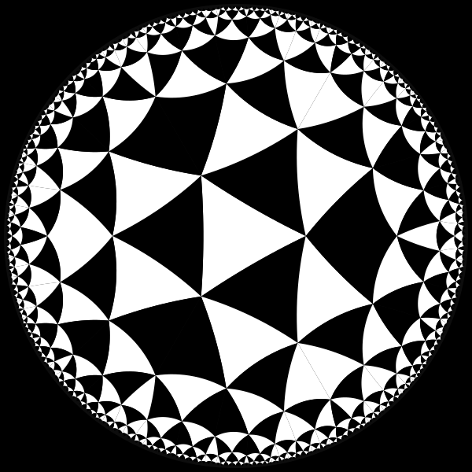

# PoincareDisk.jl


This package is a simple introduction to the Poincaré disk. This is a model of two-dimensional hyperbolic geometry in which all points are inside the unit disk. It was popularized by French mathematician Henri Poincaré (1854–1912).

[](https://cormullion.github.io/PoincareDisk.jl/stable) [](https://github.com/cormullion/PoincareDisk.jl/actions/workflows/documentation.yml?query=branch%3Amaster) [](https://codecov.io/gh/cormullion/PoincareDisk.jl) 

## Quick start

```julia
using PoincareDisk, Luxor
@draw begin
    background("black")
    sethue("grey5")
    draw_poincare_disk(action = :fill)
    setline(2)
    draw_tiling(hyperbolic_tiling(3, 7, depth=12), 
        colors=["black", "white"])
end
```


